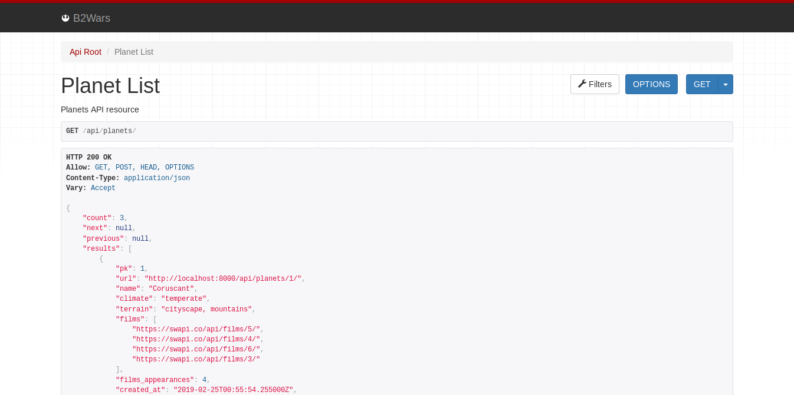
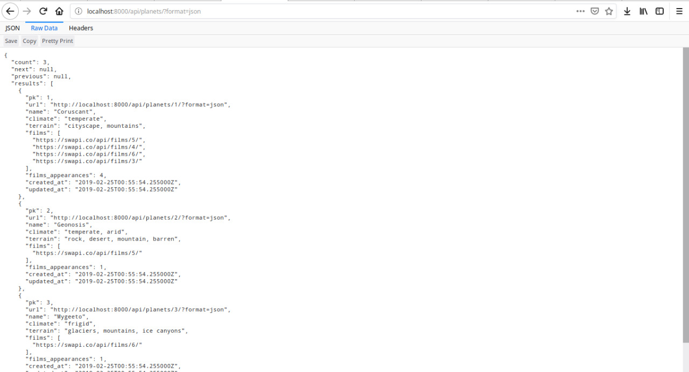

<div align="center">
    
    <h1>B2Wars</h1>
    <h3>🌌 A Star Wars Planets API 🚀</h3>
    <h3><a href="https://b2wars.herokuapp.com/api/">https://b2wars.herokuapp.com/api/</a></h3>

[](https://travis-ci.org/abekroenem/b2wars)
[](https://codecov.io/gh/abekroenem/b2wars)

</div>
<hr>

## Table of Contents

- [Introduction](#introduction)
- [Stack](#stack)
- [How to use](#how-to-use)
- [Planets Resource](#planets-resource)
- [Run local](#run-local)
- [Run with Docker](#run-with-docker)
- [Run tests](#run-tests)
- [Run coverage](#run-coverage)
- [Run linter](#run-linter)
- [Project planning](#project-planning)
- [License](#license)


# Introduction

**B2Wars** is a Star Wars Planets RESTFul API, that implements a CRUD of Star Wars planets and show how many times a planet has appeared in Star Wars franchise, by integratin with public Star Wars API: [https://swapi.co/](https://swapi.co/).    
This project was created as a solution to the challenge for the backend developer position on [B2W Digital](https://www.b2wmarketplace.com.br).


# Stack

- [Python 3.6](https://www.python.org/)
- [Django 2.1](https://www.djangoproject.com/)
- [Mongo DB 4.0](https://www.mongodb.com/)
- [Django Rest Framework 3.9](https://www.django-rest-framework.org/)
- [Djongo 1.2](https://github.com/nesdis/djongo)
- [Pipenv 2018.11.26](https://pipenv.readthedocs.io/en/latest/)
- [Docker 18.09.2-ce](https://docs.docker.com/)
- [Docker Compose 1.17](https://docs.docker.com/compose/overview/)
- [Heroku Cloud Services](https://www.heroku.com/home)


# How to use

**B2Wars API** can be used from Browsable API (html representation of API) and through `JSON` format. You can use **B2Wars** from heroku: [https://b2wars.herokuapp.com/api/](https://b2wars.herokuapp.com/api/) or locally through [http://localhost:8000/api/](http://localhost:8000/api/).

## Examples

### Browsable API

By going to [https://b2wars.herokuapp.com/api/](https://b2wars.herokuapp.com/api/), you will see a list of paginated planet objects. 




### JSON

To access a `json` representation of this results, just put [https://b2wars.herokuapp.com/api/planets/?format=json](https://b2wars.herokuapp.com/api/planets/?format=json) param at the end of url.




### Terminal

You can also make a request via any http client, with `Content-Type: application/json`. See this example with **cURL**:

```shell
curl -X GET -H 'Content-Type: application/json;' https://b2wars.herokuapp.com/api/planets/1/
```
Return
```json
{
    "pk":1,
    "url":"http://localhost:8000/api/planets/1/",
    "name":"Coruscant",
    "climate":"temperate",
    "terrain":"cityscape, mountains",
    "films":[
        "https://swapi.co/api/films/5/",
        "https://swapi.co/api/films/4/",
        "https://swapi.co/api/films/6/",
        "https://swapi.co/api/films/3/"
    ],
    "films_appearances":4,
    "created_at":"2019-02-25T00:55:54.255000Z",
    "updated_at":"2019-02-25T00:55:54.255000Z"
}
```

# Planets Resource

CRUD implementation of planets, available in `/api/planets/` resource.

### Planets entity

|Field|Type|Description|Rules|Default|
|:---|:--:|:----------|:---:|:-----:|
|`pk`|int|ID of a planet|unique,   read only|-|
|`name`|str|Name of a planet|unique, required|-|
|`climate`|str|Climate of a planet|optional|`"unknown"`|
|`terrain`|str|Terrain of a planet|optional|`"unknown"`|
|`films_appearances`|int|Number appearances in films|read only|-|
|`films`|list|Films URL where planet appears in Star Wars franchise|read only|-|
|`url`|str|Link to planet detail|read only|-|
|`created_at`|datetime|Moment when planet is created|read only|-|
|`updated_at`|datetime|Moment when planet is updated|read only|-|

### Planets Actions

|Path|Method|Status Code|Description|
|:---|:----:|:---------:|:----------|
|`/api/planets/`|`OPTIONS`|200|Shows Planets Resource structure, fields and validators|
|`/api/planets/`|`GET`|200|List all planets|
|`/api/planets/:id`|`GET`|200|Get a planet object|
|`/api/planets/`|`POST`|201|Create a planet|
|`/api/planets/:id`|`PUT`|200|Update all fields on a planet object|
|`/api/planets/:id`|`PATCH`|200|Update one or more fields on a planet object|
|`/api/planets/:id`|`DELETE`|204|Delete a planet|

#### List all planets

```shell
curl -X GET -H 'Content-Type: application/json;' https://b2wars.herokuapp.com/api/planets/
```
Return
```json
HTTP/1.1 200 OK

{
    "count": 3,
    "next": null,
    "previous": null,
    "results": [
        {
            "pk": 1,
            "url": "https://b2wars.herokuapp.com/api/planets/1/",
            "name": "Coruscant",
            "climate": "temperate",
            "terrain": "cityscape, mountains",
            "films": [
                "https://swapi.co/api/films/5/", 
                "https://swapi.co/api/films/4/", 
                "https://swapi.co/api/films/6/", 
                "https://swapi.co/api/films/3/"
            ],
            "films_appearances": 4,
            "created_at": "2019-02-25T16:04:05.763000Z",
            "updated_at": "2019-02-25T16:04:05.763000Z"
        }, 
        {
            "pk": 2,
            "url": "https://b2wars.herokuapp.com/api/planets/2/",
            "name": "Geonosis",
            "climate": "temperate, arid",
            "terrain": "rock, desert, mountain, barren",
            "films": [
                "https://swapi.co/api/films/5/"
            ],
            "films_appearances": 1,
            "created_at": "2019-02-25T16:04:05.763000Z",
            "updated_at": "2019-02-25T16:04:05.763000Z"
        }, 
        {
            "pk": 3,
            "url": "https://b2wars.herokuapp.com/api/planets/3/",
            "name": "Mygeeto",
            "climate": "frigid",
            "terrain": "glaciers, mountains, ice canyons",
            "films": [
                "https://swapi.co/api/films/6/"
            ],
            "films_appearances": 1,
            "created_at": "2019-02-25T16:04:05.763000Z",
            "updated_at": "2019-02-25T16:04:05.763000Z"
        }
    ]
}
```

#### Create a planet

```shell
curl -X POST \
     -H 'Content-Type: application/json;' \
     -d '{ "name": "Jakku", "terrain": "deserts"}' \
     https://b2wars.herokuapp.com/api/planets/
```
Successful return :heavy_check_mark:
```json
HTTP/1.1 201 Created

{
    "pk": 5,
    "url": "https://b2wars.herokuapp.com/api/planets/5/",
    "name": "Jakku",
    "climate": "unknown",
    "terrain": "deserts",
    "films": [
        "https://swapi.co/api/films/7/"
    ],
    "films_appearances": 1,
    "created_at": "2019-02-25T18:17:11.003241Z",
    "updated_at": "2019-02-25T18:17:11.003279Z"
}
```
Error return (tries to add duplicated `name`) :x:

```json
HTTP/1.1 400 Bad request

{
    "name": [
        "planet with this Name already exists."
    ]
}
```

#### Update all fields from product

```shel
curl -X PUT \
     -H 'Content-Type: application/json;' \
     -d '{ "name": "coruscant", "climate": "hot", "terrain": "mountains"}' \
     https://b2wars.herokuapp.com/api/planets/1/
```
Successful return :heavy_check_mark:
```json
HTTP/1.1 200 Ok

{
    "pk": 1,
    "url": "https://b2wars.herokuapp.com/api/planets/1/",
    "name": "coruscant",
    "climate": "hot",
    "terrain": "mountains",
    "films": [
        "https://swapi.co/api/films/5/", 
        "https://swapi.co/api/films/4/", 
        "https://swapi.co/api/films/6/", 
        "https://swapi.co/api/films/3/"
    ],
    "films_appearances": 4,
    "created_at": "2019-02-25T13:09:20.220000Z",
    "updated_at": "2019-02-25T18:35:42.484955Z"
}
```
Error return (tries to update without passing fields) :x:
```json
HTTP/1.1 400 Bad Request
{
    "name":[
        "This field is required."
    ]
}
```

#### Delete a planet
```shel
curl -X DELETE \
     -H 'Content-Type: application/json;' \
     https://b2wars.herokuapp.com/api/planets/1/
```
Successful return :heavy_check_mark:
```json
HTTP/1.1 204 No Content


```
Error (invalid `:id` provided) :x:
```json
HTTP/1.1 404 Not Found
{
    "detail": "Not found."
}
```

### Search in Planets

#### Search by name

```
/api/planets/?name=jakku
```
Returns all planets that `Planet.name` field **contains** `name` param

```
/api/planets/?name__exact=jakku
```
Returns a planet that `Planet.name` field **is equals** to `name` param

#### Search by climate

```
/api/planets/?climate=cold
```
Returns all planets that `Planet.climate` field **contains** `climate` param

```
/api/planets/?climate__exact=cold
```
Returns a planet that `Planet.climate` field **is equals** to `climate` param

#### Search by terrain

```
/api/planets/?terrain=mountains
```
Returns all planets that `Planet.terrain` field **contains** `terrain` param

```
/api/planets/?terrain__exact=mountains
```
Returns a planet that `Planet.terrain` field **is equals** to `terrain` param


**Note:** All of the query params searching are **case insensitive**.


# Run local

To run **B2Wars** on your local development environment, make sure to have **Python** and **pipenv** installed. Then you need to add a `local.py` file in `b2wars/settings/` folder, import all (`*`) settings from `b2wars.settings.dev` modules and change specify the connection to your mongodb server:

## Database connection

```python
# b2wars/settings/local.py
from b2wars.settings.dev import *

# MongoDB Database
DATABASES = {
    'default': {
        'ENGINE': 'djongo',
        'ENFORCE_SCHEMA': True,
        'NAME': 'my-document-name',
        'HOST': 'my-host-name',
        'USER': 'my-user-name',
        'PASSWORD': 'my-password',
        'AUTH_SOURCE': 'auth-source',
        'AUTH_MECHANISM': 'SCRAM-SHA-1' # or your authentication mechanism
    }
}
```

Django also supports relational databases backends that you can use, [see the docs](https://docs.djangoproject.com/en/2.1/ref/databases/).


## Install dependencies

```shell
$ pipenv install --dev
$ pipenv shell
```

## Start up database
```shell
$ python manage.py migrate
```

## Run application

```shell
$ python manage.py runserver
```

Go to [http://localhost:8000/api/](http://localhost:8000/api/) to access the API.


# Run with docker

To run **B2Wars** with Docker, make sure you have **Docker** and **Docker Compose** installed.
Then, just run:

```shell
docker-compose up --build
```
Output
```shell
db_1   | 2019-02-25T04:39:02.480+0000 I ACCESS   [conn4] Successfully authenticated as 
principal b2wars on admin
api_1  | February 25, 2019 - 04:39:02
api_1  | Django version 2.1.7, using settings 'b2wars.settings'
api_1  | Starting development server at http://0.0.0.0:8000/
api_1  | Quit the server with CONTROL-C.
```

# Run tests

The tests from **b2wars** uses `b2wars/settings/test.py` settings module and a `:memory:` instance of SQLite database.

## Run tests local

```shell
python runtests.py
```

## Run tests with docker

```shell
docker-compose exec api python runtests.py
```


# Run coverage

## Run coverage local

```shell
python runcov.py
```

## Run coverage with docker

```shell
docker-compose exec api python runcov.py
```

To access a **html** representation of coverage results, open the file `htmlcov/index.html` on your browser.


# Run linter

**B2Wars** uses **pylint** to measure code quality in conform to [PEP8](https://www.python.org/dev/peps/pep-0008/) recomendations.

## Run linter local

```shell
pylint *
```

## Run coverage with docker

```shell
docker-compose exec api pylint *
```

Output

```shell
-------------------------------------------------------------------
Your code has been rated at 10.00/10 (previous run: 9.97/10, +0.03)
```


# Project Planning

The Kanban Board from **B2Wars** is available in [Projects](https://github.com/abekroenem/b2wars/projects) tab. 

The first development cycle of **B2Wars** is available in [b2wars v1r0](https://github.com/abekroenem/b2wars/projects/1) version.


# License

Under [MIT](https://github.com/abekroenem/b2wars/blob/master/LICENSE) license.
